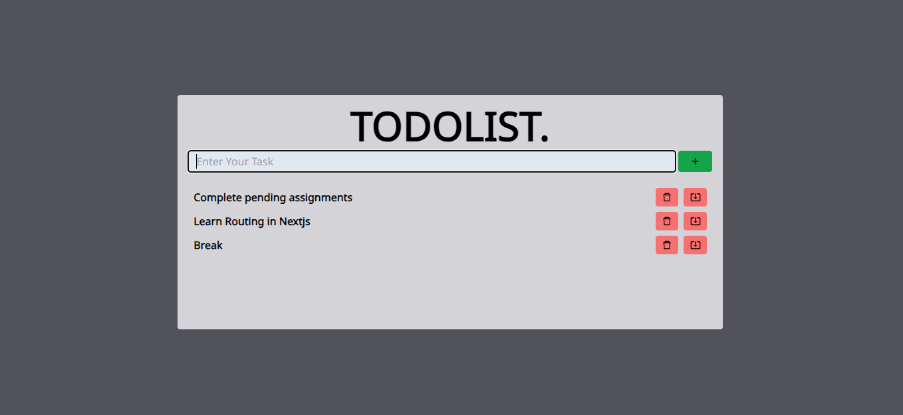

1. **Project Name:**
   ToDo App

2. **Description:**
   Create, manage, and organize your tasks effortlessly with our Todo app. Add, delete, and update tasks with ease, keeping your to-do 
   list up-to-date and organized. Stay productive and focused on what matters most with our intuitive and user-friendly interface.

3. **Features:**
   Highlight the key features of the project :
   - Add Tasks: Easily add new tasks to your list.
   - Delete Tasks: Remove tasks you no longer need with a simple click.
   - Update Tasks: Edit and modify task details as needed.
   - Organize: Arrange tasks by priority or category for better organization.
   - User-Friendly Interface: Intuitive design for seamless task management.

4. **Technologies Used:**
   List the technologies and tools used to build the project :
   - React.js
   - JavaScript
   - Tailwind CSS
    
5. **Setup Instructions:**
   1. Clone this repository.
   2. In the terminal run "npm run dev" make sure npm is installed


6. **Usage:**
   - Enter your tasks and press "Enter" or click add button.
   - For update click update button and to delete click delete button.
     
7. **Contributing:**
    Contributions are welcome! Feel free to submit bug reports, feature requests, or pull requests.
   


8. **Contact:**
    For any questions or feedback, you can reach out to me at ammaarfarhan11@gmail.com
    ```
    Feel free to customize the content to better fit your project and its specific requirements. If you have any further questions or need additional assistance, let me know!

9. **Screenshots or GIFs:**
    

   
